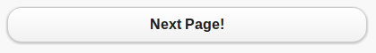
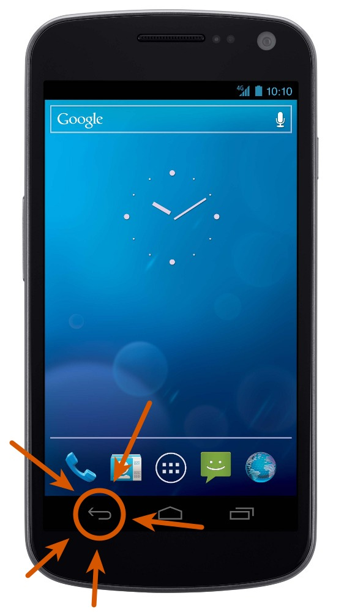

!SLIDE link
<h1 style="font-size: 7em">
  Progressive Enhancement
  <!-- oh noes div inside h1 :P -->
  
on the

  Mobile Web
</h1>
johnbender.github.com/presentation-pe-mobile-web

!SLIDE bullets mono-bullets
## me
* @johnbender
* johnbender.us
* github.com/johnbender

!SLIDE center adobe-background background-image
## jquery mobile

!SLIDE center adobe-background background-image
## rubyists
#### kstewart.me/2012/04/21/ruby-at-adobe.html

!SLIDE center good-background background-image
## good

!SLIDE center bad-background background-image
## bad

!SLIDE center sad-background background-image
## ridiculous

!SLIDE center examine-background background-image
## pe approach

!SLIDE center super-background background-image
## jquery mobile

!SLIDE center ice-cream-background background-image
# Good

!SLIDE
### growth
doubling year/year

!SLIDE
### xplatform
fairly consistent

!SLIDE
### familiar
web dev • app dev

!SLIDE
### single source
media queries • responsive

!SLIDE center mj-background background-image
# Bad

!SLIDE
### history
(push|pop|replace)State

!SLIDE
### orientation
180&#176;? 90&#176;? 0&#176;? 270&#176;?

!SLIDE
### web views
2 x each browser

!SLIDE
## tap vs click
delay • scrolling • both inputs

!SLIDE
### standards
lack thereof

!SLIDE
### heuristics
what you tap may not get a click

!SLIDE center video

Tap/Delay

<video height="576" width="384" src="file/one/tap-then-click.mp4" type='video/mp4; codecs="avc1.42E01E, mp4a.40.2"' />

<a href="https://vimeo.com/45721427">view on vimeo</a>

!SLIDE center video

Content Shift

<video height="576" width="384" src="file/one/tap-into-click.mp4" type='video/mp4; codecs="avc1.42E01E, mp4a.40.2"' />

<a href="https://vimeo.com/45718716">view on vimeo</a>

!SLIDE high-image center
</img>
</img>

!SLIDE center facepalm-background background-image
# Ridiculous

!SLIDE center webkit-background background-image
## webkit
It's all the same right?

!SLIDE center ugly-background background-image
## android

!SLIDE
### </img> is the new </img>

!SLIDE
### 2.2.x • 2.3.x
80+% percent of androids

!SLIDE
### rendering
yes, even rendering

!SLIDE
### position fixed
we use &amp;nbsp; to fix bugs

!SLIDE
### animations
toy examples work great

!SLIDE center
# PE Approach

!SLIDE
### build up
start with what always works

!SLIDE
### animations
none ⟶ simple ⟶ all

!SLIDE
### orientation
poll width/height ⟶ event

!SLIDE
### navigation
reload ⟶ hash ⟶ state

!SLIDE image
<pre class="medium" style="margin-top: 200px">
&lt;a href="/foo/bar" data-role="button"&gt;
  Next Page!
&lt;/a&gt;</pre>
</img>

!SLIDE image
<pre class="medium" style="margin-top: 200px">
&lt;a <b>href="/foo/bar"</b> data-role="button"&gt;
  Next Page!
&lt;/a&gt;</pre>
</img>

!SLIDE image
<pre class="medium" style="margin-top: 200px">
&lt;a href="/foo/bar" data-role="button"&gt;
  Next Page!
&lt;/a&gt;</pre>
</img>

!SLIDE image
<pre class="medium" style="margin-top: 200px">
&lt;a <b>href="#destination"</b> data-role="button"&gt;
  Next Page!
&lt;/a&gt;</pre>
</img>

!SLIDE video

Without JS

<video height="576" width="384" src="file/one/without-js.mp4" type='video/mp4; codecs="avc1.42E01E, mp4a.40.2"' />

<a href="https://vimeo.com/45851036">view on vimeo</a>

!SLIDE center f-yeah-background background-image
# jQuery Mobile

!SLIDE
### users
no one uses this crap

!SLIDE bullets grid users

<ul>
  <li> Sears </li>
  <li> Chase </li>
  <li> Ikea </li>
  <li> Life </li>
  <li> Stanford </li>
</ul>

<ul>
  <li> m.sears.com </li>
  <li> m.chase.com </li>
  <li> m.ikea.com </li>
  <li> m.life.com </li>
  <li> m.stanford.edu </li>
</ul>

!SLIDE
### support

!SLIDE bullets grid

<ul>
  <li> Apple iOS 3.2-5.0 </li>
  <li> Android 2.1-4.0 </li>
  <li> Windows Phone 7-7.5 </li>
  <li> Blackberry 6-7, QNX </li>
  <li> Palm WebOS 1.4-3.0 </li>
</ul>

<ul>
  <li> Firebox Mobile </li>
  <li> Opera Mobile 11.0 </li>
  <li> Meego 1.2 </li>
  <li> Chrome, Firefox </li>
  <li> IE 7+, Opera 10+ </li>
</ul>

jquerymobile.com/gbs/

!SLIDE
### github
6800+ watchers • 1200+ forks

!SLIDE
### books
10 books • 7 publishers

!SLIDE center background-image mouse-background
## vmouse

!SLIDE
### normalized
standars • one event

!SLIDE
<pre>
// fastest &amp; broken on desktop
$btn.on( <b>"touchstart"</b>, doSomething );

// slowest
$btn.on( "click", doSomething );

// fast enough &amp; safe
$btn.on( "vclick", doSomething );
</pre>

!SLIDE
<pre>
// fastest &amp; broken on desktop
$btn.on( "touchstart", doSomething );

// slowest
$btn.on( <b>"click"</b>, doSomething );

// fast enough &amp; safe
$btn.on( "vclick", doSomething );
</pre>

!SLIDE
<pre>
// fastest &amp; broken on desktop
$btn.on( "touchstart", doSomething );

// slowest
$btn.on( "click", doSomething );

// fast enough &amp; safe
$btn.on( <b>"vclick"</b>, doSomething );
</pre>

!SLIDE center video

Tap/Click

<video height="576" width="384" src="file/one/vmouse-speedup.mp4" type='video/mp4; codecs="avc1.42E01E, mp4a.40.2"' />

<a href="https://vimeo.com/45851036">view on vimeo</a>

!SLIDE center background-image return-background
## navigation
reload ⟶ hash ⟶ state

!SLIDE image center android

!SLIDE
<pre class="small">
// no hash, no ajax
foo.com/bar

// hash support
foo.com/#/bar

// replaceState support
foo.com/#/bar ⟶ foo.com/bar</pre>

!SLIDE
<pre class="small">
// no hash, no ajax
<b>foo.com/bar</b>

// hash support
foo.com/#/bar

// replaceState support
foo.com/#/bar ⟶ foo.com/bar</pre>

!SLIDE
<pre class="small">
// no hash, no ajax
foo.com/bar

// hash support
<b>foo.com/#/bar</b>

// replaceState support
foo.com/#/bar ⟶ foo.com/bar</pre>

!SLIDE
<pre class="small">
// no hash, no ajax
foo.com/bar

// hash support
foo.com/#/bar

// replaceState support
<b>foo.com/#/bar ⟶ foo.com/bar</b></pre>

!SLIDE center video

Hashchange

<video height="576" width="384" src="file/one/nav-hashchange.mp4" type='video/mp4; codecs="avc1.42E01E, mp4a.40.2"' />

<a href="https://vimeo.com/45854912">view on vimeo</a>

!SLIDE center video

Pushstate

<video height="576" width="384" src="file/one/nav-replacestate.mp4" type='video/mp4; codecs="avc1.42E01E, mp4a.40.2"' />

<a href="https://vimeo.com/45854913">view on vimeo</a>

!SLIDE center builder-background background-image
## builder
jquerymobile.com/download-builder/

!SLIDE center pleading-background background-image
<h1 style="margin-top: 100px">Use Something</h1>
for the seals

!SLIDE bullets mono-bullets
## thanks
* @johnbender
* johnbender.us
* github.com/johnbender
